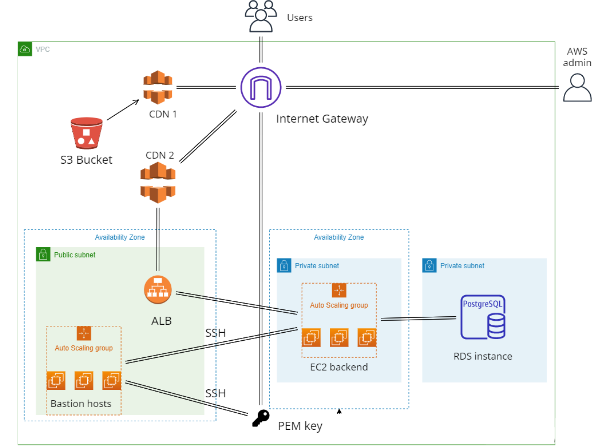

This repository is our solution to AWS DevOps academy powered by Code.Hub. Our target was to keep this project within the free tier of AWS. Since NAT gateways are not free, we had to think around this limitation and create custom AMI in order to install our software in backend EC2s

The target of the project is to deploy a scalable e-shop application in AWS.
Our final architect is described this:

Note: we are still developing our AWS drawing skills

90% of this architecture can be created by these terraform files. Just create a terraform.tfvars file!
